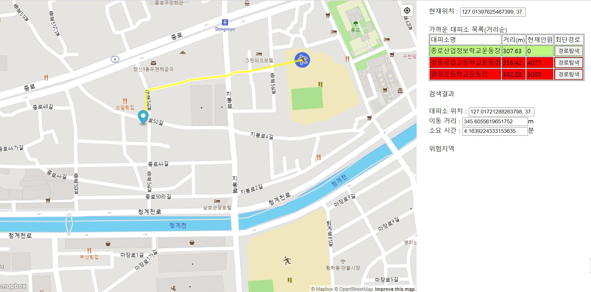

## ShelterFinder

ShelterFinder는 지진 상황에서 사용자에게 현재 위치로부터 가까운 지진 대피소로 빠르게 대피할 수 있는 경로를 안내하는 웹 프로그램입니다. 

## About

[ShelterFinder_1](https://aka2344.github.io/studyproj)

[ShelterFinder_2](https://aka2344.github.io/studyproj2)

